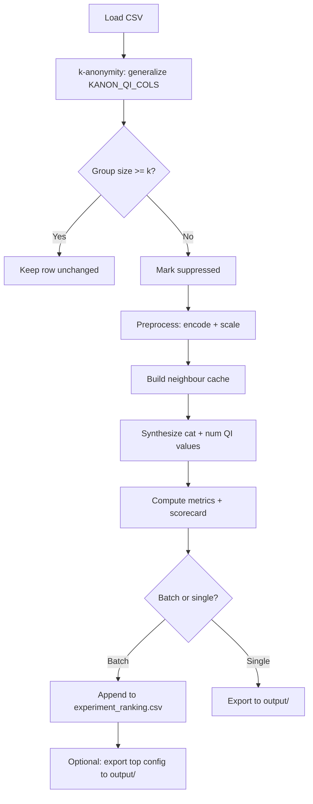

# Production Pipeline Walkthrough (No_target)

This document explains **what happens** when you run `production_pipeline.ipynb` in the `No_target/` folder.

---

## Big picture

The pipeline takes the bank churn CSV, finds customers who are **too unique** (k-anonymity failure), replaces their quasi-identifier values with **synthetic values** built from similar neighbours, then **scores** how good the result is.

`churn` is the **target** (`TARGET_COL`): excluded from KNN distance, synthesized from neighbours via `target_gen_method` (Karabo-style). Feature QI columns are `country`, `gender`, and numerics.

```
CSV in  →  k-anonymity  →  KNN neighbours  →  synthesis  →  metrics  →  ranking / export
```

---

## Notebook sections (in order)

| Step | Notebook section | What it does |
|------|------------------|--------------|
| 0 | Imports & paths | Sets `PIPELINE_ROOT`, column lists, thresholds; checks required files exist |
| 1 | CONFIG | Chooses `batch` or `single`, grid path, `BATCH_LIMIT`, manual params |
| 2 | Pipeline functions | All logic (suppression, distance, synthesis, metrics) |
| 3 | Load data | Reads CSV and validates columns |
| 4 | Run experiments | Batch loop or single run: synthesize + score each config |
| 5 | Export (optional) | Writes best/single run to `output/` |

---

## Column model

```python
CATEGORICAL_COLS = ["country", "gender"]
TARGET_COL = "churn"
NUMERICAL_COLS   = ["credit_score", "age", "tenure", "balance",
                    "products_number", "credit_card", "active_member", "estimated_salary"]
KANON_QI_COLS    = country, gender + numerics (no churn)
ROW_SYNTHESIS_MODE = "donor"
```

| Column group | Used for |
|--------------|----------|
| `CATEGORICAL_COLS` | Feature categoricals: encoding, distance, synthesis (`cat_gen_method`), TVD |
| `TARGET_COL` | Label column: **not** in KNN distance; synthesized via `target_gen_method` from neighbours |
| `NUMERICAL_COLS` | Scaling, distance, synthesis (`num_gen_method`), KS checks |
| `KANON_QI_COLS` | k-anonymity grouping (excludes `TARGET_COL`) |
| `RELATIONSHIP_COL` | Same as `TARGET_COL`; relationship drift vs feature QI |

---

## Stage 1 — Load and validate

1. Resolve `No_target/` as pipeline root (must contain the data CSV).
2. Load `Bank Customer Churn Prediction.csv` (~10,000 rows).
3. Drop empty columns; verify all QI columns exist.
4. Validate `RELATIONSHIP_COL` (if set) is listed in `QI_COLS`.

**Output:** in-memory `df`.

---

## Stage 2 — k-Anonymity and suppression

For each config’s `k_anonymity` value:

### 2.1 Generalize quasi-identifiers

Before counting groups, values are bucketed so similar people land in the same class:

| Column | Generalization |
|--------|----------------|
| `credit_score` | Round down to nearest 50 |
| `age` | Round down to nearest 5 |
| `balance` | 20 quantile buckets (string labels) |
| `estimated_salary` | 20 quantile buckets (string labels) |
| `country`, `gender`, `churn` | Kept as string categories |

### 2.2 Count equivalence classes

Rows are grouped by all `KANON_QI_COLS`. If a group has **fewer than `k_anonymity` members**, every row in that group is **suppressed**.

### 2.3 Result

- **Pool rows** (not suppressed): can donate neighbour values; left unchanged in output.
- **Suppressed rows**: will get new synthetic QI values (including `churn`).

Because `churn` is in `KANON_QI_COLS`, suppression counts are **higher** than pipelines that excluded churn from k-anonymity.

---

## Stage 3 — Preprocessing

For each `scaler_method` in the config (`standard`, `minmax`, or `robust`):

1. **Categorical:** label-encode each column in `CATEGORICAL_COLS`.
2. **Numeric:** fill missing with median, fit scaler, produce `X_num` (scaled) and `num_filled` (raw).
3. Store encoders, percentile clip bounds (p01/p99), and range info for Gower distance.

Preprocessors are **cached per scaler** during batch runs.

---

## Stage 4 — Neighbour search (KNN)

For each suppressed row, find the **K nearest pool rows** (K = `k_neighbors`).

### Distance modes

**`weighted_sum`**
```
total_dist = num_weight × numeric_distance + cat_weight × categorical_distance
```
- Numeric: euclidean, manhattan, or minkowski
- Categorical: hamming, jaccard, or overlap

**`gower`**
- Mixed per-column numeric + categorical formula on raw numeric values and encoded categories
- Ignores `num_weight`, `cat_weight`, and metric choices for neighbour search
- Neighbour cache keyed only on `(k_anonymity, "gower")` for speed

Neighbour indices and distances are **cached** per config key to avoid recomputation in batch mode.

### Neighbour weights

```
weight_i = 1 / (distance_i + ε)
weights normalized to sum to 1
```

Closer neighbours get higher weight during synthesis.

---

## Stage 5 — Synthesis (suppressed rows only)

For each suppressed row:

### Row synthesis mode (`ROW_SYNTHESIS_MODE`)

| Mode | Behaviour |
|------|-----------|
| `donor` (default) | Pick one weighted neighbour; sample categoricals from the neighbour pool with those weights; interpolate numerics between the suppressed row and the donor (t ∈ 0.1–0.9). Preserves correlations better than independent column synthesis. |
| `independent` | Legacy per-column synthesis (`cat_gen_method` + `num_gen_method` independently per column). |

### Categorical columns (incl. `churn`)

Pick a value from K neighbours using `cat_gen_method`:

| Method | Behaviour |
|--------|-----------|
| `mode` | Most frequent neighbour value |
| `weighted_mode` | Weighted vote (closer neighbours count more) |
| `probability` | Random sample proportional to weights |

### Numeric columns

Generate in **scaled space**, then inverse-transform and clip to p01–p99:

| Method | Behaviour |
|--------|-----------|
| `interpolation` | Move partway from current value toward a random neighbour |
| `weighted_mean` | Weighted average of neighbour values |

### Write back

Only `QI_COLS` on suppressed rows are updated. `customer_id` is untouched. Non-suppressed rows are identical to input.

> **Note:** `target_gen_method` in the parameter CSV is **not used** in No_target.

---

## Stage 6 — Validation metrics

Each run produces a scorecard. **`overall_pass = True`** only if **all** checks pass.

| Check | What it measures | Pass rule |
|-------|------------------|-----------|
| TVD (categorical) | Distribution drift per cat column (incl. churn) | ≥85% of columns with TVD < 0.10 |
| KS (numeric) | Distribution drift per numeric column | ≥85% of columns with KS < 0.10 |
| Mean KS | Average numeric drift | Mean KS < 0.10 |
| Relationship drift | Cramér's V (categorical QI) or Pearson correlation (numeric QI) vs `RELATIONSHIP_COL` | Mean drift < 0.05 |
| Privacy | Exact row matches among replaced rows | < 0.1% |
| Suppression | At least one row was replaced | `n_suppressed > 0` |

### Ranking (`finalize_ranking`)

Configs are sorted in two tiers:

1. **`overall_pass = True` first** (all scorecard gates passed).
2. Within each tier, by **`composite_score`** (higher is better).

**Component scores (all ~0–1 scale):**

| Component | Formula | Weight in `quality_score` |
|-----------|---------|---------------------------|
| TVD pass rate | already 0–1 | 33% |
| KS pass rate | already 0–1 | 33% |
| Relationship score | `1 - min(mean_corr_drift / 0.05, 1)` | 20% |
| KS quality | `1 - min(mean_ks / 0.10, 1)` | 14% |

```
quality_score = weighted sum of components above
composite_score = quality_score - 0.02 × (runtime / max_runtime)   # small tiebreaker
```

**Tie-breakers (after composite_score):** lower `mean_corr_drift`, lower `runtime_sec`.

Extra columns in `experiment_ranking.csv`: `relationship_col`, `relationship_score`, `ks_quality`, `quality_score`.

Configs that fail any scorecard gate (`overall_pass = False`) always rank below passing configs, regardless of composite score.

---

## Batch mode vs single mode

### Batch (`RUN_MODE = "batch"`)

1. Read `parameter_combinations.csv` (one row = one experiment).
2. For each row: suppress → preprocess → neighbours → synthesize → metrics.
3. Append results to `results/experiment_ranking.csv`.
4. Skip folders already in ranking (resume support).
5. Checkpoint every `CHECKPOINT_EVERY` configs.

### Single (`RUN_MODE = "single"`)

1. Use manual CONFIG values (`K_ANONYMITY`, `K_NEIGHBORS`, etc.).
2. Run one experiment.
3. Optionally export to `output/` via the export cell.

---

## Stage 7 — Export (optional)

When `EXPORT_TOP_TO_OUTPUT = True` (batch) or after single mode:

Writes to `output/`:

| File | Contents |
|------|----------|
| `anonymized_dataset.csv` | Full dataset with suppressed rows replaced |
| `category_metrics.csv` | TVD per categorical column |
| `numeric_metrics.csv` | KS per numeric column |
| `relationship_metrics.csv` | Drift vs `RELATIONSHIP_COL` |
| `scorecard.csv` | Pass/fail per check |
| `summary.json` | Runtime, memory, overall_pass, relationship_col |
| `config.json` | Parameters used for this run |

---

## End-to-end flow (mermaid)



---

## What changes between experiments?

Each row in `parameter_combinations.csv` varies things like:

- `k_anonymity`, `k_neighbors`
- `cat_gen_method`, `num_gen_method`
- `scaler_method`, `distance_mode`
- Distance metrics and weights (weighted_sum only)

Things that **do not** change between experiments:

- Dataset file
- Column lists (`CATEGORICAL_COLS`, `NUMERICAL_COLS`)
- `RELATIONSHIP_COL` (set in notebook, not in CSV)
- `target_gen_method` (ignored)

---

## Quick reference — where to look in code

| Question | Function / cell |
|----------|-----------------|
| Who gets suppressed? | `identify_suppressed()` |
| How are neighbours found? | `build_neighbor_cache()` |
| How are values generated? | `synthesize_dataset()` |
| How is quality scored? | `compute_metrics()` |
| How are experiments ranked? | `finalize_ranking()` |
| Parameter meanings? | `parameter_reference.csv` |

---

## Full function logic (all functions)

This section documents the logic of every function in `production_pipeline.ipynb`.

### `resolve_pipeline_root() -> Path`
- Tries candidate directories (`cwd`, `cwd/No_target`, notebook file folder) to find one containing `Bank Customer Churn Prediction.csv`.
- Returns that folder as `PIPELINE_ROOT`.
- Raises `FileNotFoundError` if no valid root is found.

### `generalize_for_kanonymity(df, qi_cols)`
- Takes the k-anonymity grouping columns and applies coarse bucketing:
  - `credit_score` -> floor to 50s.
  - `age` -> floor to 5s.
  - `balance` / `estimated_salary` -> quantile bins (20 buckets).
- Ensures object/categorical columns are string-filled with `MISSING_LABEL`.
- Returns generalized dataframe used only for equivalence-class counting.

### `identify_suppressed(df, k_anonymity)`
- Calls `generalize_for_kanonymity(...)` on `KANON_QI_COLS`.
- Groups by generalized columns and computes class size per row.
- Marks rows with class size `< k_anonymity` as suppressed.
- Returns `(suppressed_mask, pool_idx, synth_idx)`:
  - `pool_idx`: non-suppressed donor rows.
  - `synth_idx`: suppressed rows to synthesize.

### `fit_preprocessors(df, scaler_method)`
- Fits `LabelEncoder` per categorical column.
- Fills numeric missing values with medians.
- Fits chosen scaler (`standard|minmax|robust`) on numerics.
- Computes numeric p01/p99 clip limits and ranges.
- Returns preprocessing artifacts (`X_cat`, `X_num`, encoders, medians, bounds, ranges).

### `categorical_pairwise_distance(pool_cat, synth_cat, metric)`
- Computes pairwise categorical distance matrix between suppressed rows and pool rows.
- Supports:
  - `hamming`: mismatch fraction.
  - `jaccard`: 1 - Jaccard-like similarity over encoded categories.
  - `overlap`: 1 - exact-match ratio.
- Returns matrix shape `(n_suppressed, n_pool)`.

### `build_neighbor_cache(cfg, prep, pool_idx, synth_idx)`
- Builds neighbour distances for all suppressed rows.
- `gower` mode:
  - Uses raw numeric values normalized by ranges + categorical mismatch terms.
- `weighted_sum` mode:
  - Numeric distance (`euclidean|manhattan|minkowski`) in scaled numeric space.
  - Plus weighted categorical distance.
- Selects top `k_neighbors` nearest pool rows per suppressed row.
- Returns cache: `row_idx -> (sorted_distances, sorted_neighbor_indices)`.

### `generate_categorical(vals, weights, method, rng)`
- Generates one categorical value from neighbour values using:
  - `mode`
  - `weighted_mode`
  - `probability` (weighted random draw)
- Used for all categorical QI fields (including `churn`).

### `_cast_column_value(col, val, df)`
- Casts synthesized values back to proper type:
  - Integer-like categoricals back to int where possible.
  - Integer numerics rounded to int.
- Prevents type drift in output dataframe.

### `synthesize_dataset(df, cfg, prep, suppressed, pool_idx, synth_idx, neighbor_cache)`
- For each suppressed row:
  - Gets cached neighbours and inverse-distance weights.
  - Synthesizes all categorical columns via `generate_categorical`.
  - Synthesizes all numeric columns via `num_gen_method`:
    - `interpolation` in scaled space.
    - `weighted_mean` in scaled space.
  - Inverse-transforms numerics and clips to p01/p99.
  - Writes synthesized values into output for `QI_COLS`.
- Non-suppressed rows remain unchanged.
- Returns `df_out`.

### `cramers_v(x, y)`
- Computes Cramer's V from a contingency table.
- Used for relationship drift when `RELATIONSHIP_COL` is categorical.

### `compute_metrics(df_actual, df_out, suppressed, relationship_col=None)`
- Computes categorical quality:
  - TVD per categorical column + pass flag.
- Computes numeric quality:
  - KS per numeric column + pass flag.
- Computes relationship drift against `relationship_col` (if set):
  - Cramer's V drift for categorical label.
  - Correlation drift for numeric label.
- Computes exact-match privacy rate over replaced rows.
- Builds scorecard (6 checks; no predictive-utility / F1 gate) and `overall_pass`.
- Returns all metric tables + summary stats used in ranking/export.

### `is_valid_config(cfg)`
- Encodes redundancy rules for grid filtering:
  - Gower canonical values only (`hamming`, `minmax`, `euclidean`, weights 1/1).
  - `minkowski_p` constrained when metric is not minkowski.
- Primarily used by grid filtering scripts/checks.

### `config_to_key(cfg)`
- Builds cache key for neighbour matrix reuse.
- Special case: Gower key collapses to `(k_anonymity, "gower")`.
- Weighted-sum keys include scaler/metric/weights.

### `make_folder_name(idx, cfg)`
- Creates deterministic experiment folder ID from config values.
- Used to resume and de-duplicate batch runs.

### `make_display_name(cfg)`
- Creates compact human-readable experiment name.
- Used in ranking output.

### `finalize_ranking(rows)`
- Converts collected run rows to dataframe.
- Computes `relationship_score`, `ks_quality`, `quality_score`, and `composite_score`.
- Sorts with `overall_pass` as the primary key, then `composite_score`, then lower `mean_corr_drift`, then lower `runtime_sec`.
- Assigns rank (1..N).

### `row_to_config(row)`
- Parses one CSV row into typed config dict.
- Handles numeric casting and optional legacy `target_gen_method`.

### `export_production_outputs(df_out, metrics, cfg, run_name="Production Run")`
- Writes:
  - anonymized dataset
  - category/numeric/relationship metrics
  - scorecard
  - summary JSON
  - config JSON files
- Used in single mode or top-config export from batch mode.

---

## Related files

- `README.md` — folder overview and quick start
- `validate_anonymization.py` — standalone validation of `output/anonymized_dataset.csv` vs original
- `KNN_Anonymization_Project_Guide.docx` — full project guide for stakeholders
- `parameter_reference.csv` — parameter definitions
- `bank_churn_eda.ipynb` — exploratory analysis before running the pipeline
